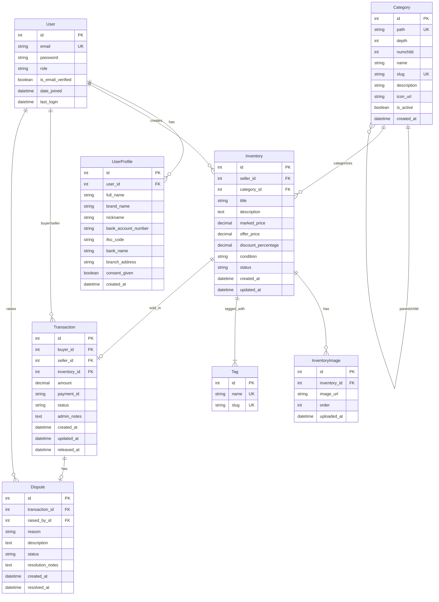

# Database Schema Design: Pre-Owned Gadgets Marketplace

## Overview

This document defines the complete database schema for the marketplace including:
- Entity Relationship Diagram (ERD)
- Django models with all fields and relationships
- Indexes and constraints for performance
- Sample data structure

**Database:** PostgreSQL 14+  
**ORM:** Django 4.2+  
**Region:** India (ap-south-1)

---

## Entity Relationship Diagram (ERD)



---

## Django Models

### App Structure

```
marketplace/
├── accounts/           # User, UserProfile
├── categories/         # Category (django-treebeard)
├── inventorys/          # Inventory, InventoryImage, Tag (django-taggit)
├── transactions/      # Transaction, Dispute
└── core/              # Shared utilities
```

---

## 1. Accounts App

### models.py

```python
import uuid
from django.contrib.auth.models import AbstractUser
from django.db import models
from django.core.validators import RegexValidator
from cryptography.fernet import Fernet
from django.conf import settings


class User(AbstractUser):
    """
    Custom user model with role-based authentication
    """
    
    class Role(models.TextChoices):
        BUYER = 'BUYER', 'Buyer'
        SELLER = 'SELLER', 'Seller'
        ADMIN = 'ADMIN', 'Admin'
    
    class SellerPlan(models.TextChoices):
        SELF_SELL = 'SELF_SELL', 'Self Sell'
        SMART_SELL = 'SMART_SELL', 'Smart Sell'
        DONATE = 'DONATE', 'Donate'
    
    class DonationPercentage(models.IntegerChoices):
        FIFTY = 50, '50%'
        HUNDRED = 100, '100%'
    
    # Core Identity
    uuid = models.UUIDField(default=uuid.uuid4, editable=False, unique=True, db_index=True)
    email = models.EmailField(unique=True, db_index=True)
    username = models.CharField(max_length=150, unique=True, db_index=True)
    
    # Personal Information
    full_name = models.CharField(max_length=255)
    
    # Email Verification
    is_email_verified = models.BooleanField(default=False)
    email_verification_token = models.CharField(max_length=100, blank=True, db_index=True)
    email_verification_expiry = models.DateTimeField(null=True, blank=True)
    
    # Mobile Verification
    mobile = models.CharField(
        max_length=15,
        blank=True,
        validators=[
            RegexValidator(
                regex=r'^\+?1?\d{9,15}$',
                message='Phone number must be entered in the format: "+919876543210"'
            )
        ]
    )
    mobile_verified = models.BooleanField(default=False)
    mobile_last_verified_on = models.DateTimeField(null=True, blank=True)
    
    # Payment Information
    upi_id = models.CharField(max_length=100, blank=True)
    upi_id_last_verified_on = models.DateTimeField(null=True, blank=True)
    
    # Seller Configuration
    seller_plan = models.CharField(
        max_length=20,
        choices=SellerPlan.choices,
        blank=True,
        help_text="Seller's chosen plan"
    )
    donation_percentage = models.IntegerField(
        choices=DonationPercentage.choices,
        null=True,
        blank=True,
        help_text="Donation percentage if seller_plan is DONATE"
    )
    net_earnings = models.DecimalField(
        max_digits=12,
        decimal_places=2,
        default=0.00,
        help_text="Total earnings in INR"
    )
    
    # Role & Status
    role = models.CharField(
        max_length=10,
        choices=Role.choices,
        default=Role.BUYER,
        db_index=True,
        help_text="Auto-assigned: BUYER by default, SELLER if has inventory"
    )
    
    # Personal Preference
    favorite_book = models.CharField(max_length=255, blank=True)
    
    # Status Fields
    active = models.BooleanField(default=True, db_index=True)
    archived = models.BooleanField(default=False, db_index=True)
    
    # Timestamps
    created_on = models.DateTimeField(auto_now_add=True)
    updated_on = models.DateTimeField(auto_now=True)
    
    USERNAME_FIELD = 'email'
    REQUIRED_FIELDS = ['username', 'full_name']
    
    class Meta:
        db_table = 'users'
        verbose_name = 'User'
        verbose_name_plural = 'Users'
        indexes = [
            models.Index(fields=['email', 'is_email_verified']),
            models.Index(fields=['role', 'active']),
            models.Index(fields=['uuid']),
            models.Index(fields=['mobile', 'mobile_verified']),
            models.Index(fields=['active', 'archived']),
        ]
    
    def __str__(self):
        return f"{self.email} ({self.get_role_display()})"
    
    def auto_assign_role(self):
        """
        Auto-assign role based on inventory:
        - Has inventorys → SELLER
        - No inventorys → BUYER
        """
        if self.role == self.Role.ADMIN:
            return  # Don't change admin role
        
        has_inventory = self.inventorys.filter(status='ACTIVE').exists()
        new_role = self.Role.SELLER if has_inventory else self.Role.BUYER
        
        if self.role != new_role:
            self.role = new_role
            self.save(update_fields=['role', 'updated_on'])
    
    def verify_email(self, token):
        """Verify email with token"""
        from django.utils import timezone
        if (self.email_verification_token == token and 
            self.email_verification_expiry and 
            self.email_verification_expiry > timezone.now()):
            self.is_email_verified = True
            self.email_verification_token = ''
            self.email_verification_expiry = None
            self.save(update_fields=['is_email_verified', 'email_verification_token', 
                                    'email_verification_expiry', 'updated_on'])
            return True
        return False
    
    def verify_mobile(self):
        """Mark mobile as verified"""
        from django.utils import timezone
        self.mobile_verified = True
        self.mobile_last_verified_on = timezone.now()
        self.save(update_fields=['mobile_verified', 'mobile_last_verified_on', 'updated_on'])
    
    def verify_upi_id(self):
        """Mark UPI ID as verified"""
        from django.utils import timezone
        self.upi_id_last_verified_on = timezone.now()
        self.save(update_fields=['upi_id_last_verified_on', 'updated_on'])
    
    def add_earnings(self, amount):
        """Add to net earnings"""
        self.net_earnings += amount
        self.save(update_fields=['net_earnings', 'updated_on'])


class UserProfile(models.Model):
    """
    Extended profile for sellers with bank details
    Auto-generates unique cool nicknames (Reddit-style)
    """
    
    user = models.OneToOneField(
        User,
        on_delete=models.CASCADE,
        related_name='user_profile'
    )
    
    # Personal Information
    full_name = models.CharField(max_length=255)
    brand_name = models.CharField(max_length=255, blank=True)
    nickname = models.CharField(
        max_length=100,
        unique=True,
        db_index=True,
        help_text="Auto-generated unique cool name (Reddit-style)"
    )
    
    # Bank Details (Encrypted)
    bank_account_number = models.BinaryField()  # Encrypted
    ifsc_code = models.CharField(
        max_length=11,
        validators=[
            RegexValidator(
                regex=r'^[A-Z]{4}0[A-Z0-9]{6}$',
                message='Invalid IFSC code format'
            )
        ]
    )
    bank_name = models.CharField(max_length=255)
    branch_address = models.TextField(blank=True)
    
    # Consent
    consent_given = models.BooleanField(default=False)
    consent_timestamp = models.DateTimeField(null=True, blank=True)
    
    # Metadata
    created_at = models.DateTimeField(auto_now_add=True)
    updated_at = models.DateTimeField(auto_now=True)
    
    class Meta:
        db_table = 'user_profiles'
        verbose_name = 'Seller Profile'
        verbose_name_plural = 'Seller Profiles'
    
    def __str__(self):
        return f"{self.user.email} - {self.nickname}"
    
    def save(self, *args, **kwargs):
        """Auto-generate nickname if not set"""
        if not self.nickname:
            self.nickname = self.generate_unique_nickname()
        super().save(*args, **kwargs)
    
    @staticmethod
    def generate_unique_nickname():
        """
        Generate unique Reddit-style nicknames
        Format: AdjectiveNoun#### (e.g., CoolPanda4782)
        """
        import random
        
        adjectives = [
            'Cool', 'Swift', 'Bright', 'Smart', 'Epic', 'Mega', 'Ultra', 'Super',
            'Wild', 'Bold', 'Quick', 'Lucky', 'Happy', 'Mighty', 'Noble', 'Proud',
            'Cosmic', 'Electric', 'Golden', 'Silver', 'Quantum', 'Turbo', 'Stellar'
        ]
        
        nouns = [
            'Panda', 'Tiger', 'Eagle', 'Falcon', 'Phoenix', 'Dragon', 'Lion', 'Wolf',
            'Hawk', 'Bear', 'Fox', 'Shark', 'Panther', 'Cobra', 'Raven', 'Lynx',
            'Viper', 'Jaguar', 'Otter', 'Badger', 'Racoon', 'Falcon', 'Condor'
        ]
        
        while True:
            adjective = random.choice(adjectives)
            noun = random.choice(nouns)
            number = random.randint(1000, 9999)
            nickname = f"{adjective}{noun}{number}"
            
            # Check uniqueness
            if not UserProfile.objects.filter(nickname=nickname).exists():
                return nickname
    
    def set_bank_account(self, account_number):
        """Encrypt and store bank account number"""
        cipher = Fernet(settings.ENCRYPTION_KEY)
        encrypted = cipher.encrypt(account_number.encode())
        self.bank_account_number = encrypted
    
    def get_bank_account(self):
        """Decrypt and return bank account number"""
        cipher = Fernet(settings.ENCRYPTION_KEY)
        decrypted = cipher.decrypt(self.bank_account_number)
        return decrypted.decode()
    
    @property
    def is_complete(self):
        """Check if profile is 100% complete"""
        return all([
            self.full_name,
            self.bank_account_number,
            self.ifsc_code,
            self.bank_name,
            self.consent_given,
        ])


class Media(models.Model):
    """
    Central media repository for all images (profile photos, inventory images, etc.)
    One media can be associated with multiple inventorys or profiles (reusable)
    """
    
    class FileType(models.TextChoices):
        IMAGE_JPEG = 'image/jpeg', 'JPEG Image'
        IMAGE_PNG = 'image/png', 'PNG Image'
        IMAGE_WEBP = 'image/webp', 'WebP Image'
        IMAGE_GIF = 'image/gif', 'GIF Image'
    
    # Core Identity
    uuid = models.UUIDField(default=uuid.uuid4, editable=False, unique=True, db_index=True)
    
    # File Information
    file_name = models.CharField(max_length=255)
    alt_tag = models.CharField(
        max_length=255,
        blank=True,
        help_text="Alt text for accessibility"
    )
    file_type = models.CharField(
        max_length=20,
        choices=FileType.choices,
        help_text="Auto-captured from content type"
    )
    
    # Storage
    s3_url = models.URLField(
        max_length=500,
        unique=True,
        help_text="Full S3 URL with CDN"
    )
    
    # Metadata
    created_on = models.DateTimeField(auto_now_add=True, db_index=True)
    
    # Status
    status = models.BooleanField(
        default=True,
        db_index=True,
        help_text="Active/Inactive"
    )
    archived = models.BooleanField(
        default=False,
        db_index=True,
        help_text="Soft delete"
    )
    
    class Meta:
        db_table = 'media'
        verbose_name = 'Media'
        verbose_name_plural = 'Media'
        ordering = ['-created_on']
        indexes = [
            models.Index(fields=['uuid']),
            models.Index(fields=['status', 'archived']),
            models.Index(fields=['file_type', 'status']),
            models.Index(fields=['created_on']),
        ]
    
    def __str__(self):
        return f"{self.file_name} ({self.uuid})"
    
    def get_usage_count(self):
        """Get count of how many times this media is used"""
        profile_usage = self.profile_images.count()
        inventory_usage = self.inventory_images.count()
        return profile_usage + inventory_usage
    
    def is_reusable(self):
        """Check if media can be reused (not archived, active)"""
        return self.status and not self.archived
    
    @classmethod
    def create_from_upload(cls, file, alt_tag=''):
        """
        Create Media instance from uploaded file
        Handles S3 upload and metadata extraction
        """
        import mimetypes
        from django.core.files.storage import default_storage
        
        # Detect file type
        content_type, _ = mimetypes.guess_type(file.name)
        if content_type not in dict(cls.FileType.choices):
            raise ValueError(f"Unsupported file type: {content_type}")
        
        # Generate unique filename
        import uuid as uuid_lib
        file_uuid = uuid_lib.uuid4()
        extension = file.name.split('.')[-1]
        unique_filename = f"media/{file_uuid}.{extension}"
        
        # Upload to S3
        s3_path = default_storage.save(unique_filename, file)
        s3_url = default_storage.url(s3_path)
        
        # Create Media record
        media = cls.objects.create(
            file_name=file.name,
            alt_tag=alt_tag,
            file_type=content_type,
            s3_url=s3_url,
        )
        
        return media
```

---

## 2. Categories App

### models.py

```python
from django.db import models
from treebeard.mp_tree import MP_Node


class Category(MP_Node):
    """
    Hierarchical category model using django-treebeard
    Supports unlimited nesting (Phones > iPhone > iPhone 13)
    """
    
    name = models.CharField(max_length=100)
    slug = models.SlugField(max_length=100, unique=True, db_index=True)
    description = models.TextField(blank=True)
    icon_url = models.URLField(blank=True)
    is_active = models.BooleanField(default=True, db_index=True)
    created_at = models.DateTimeField(auto_now_add=True)
    
    node_order_by = ['name']  # Treebeard: order children alphabetically
    
    class Meta:
        db_table = 'categories'
        verbose_name = 'Category'
        verbose_name_plural = 'Categories'
        indexes = [
            models.Index(fields=['slug', 'is_active']),
            models.Index(fields=['path']),  # Treebeard materialized path
        ]
    
    def __str__(self):
        return self.get_full_path()
    
    def get_full_path(self):
        """Get full category path (e.g., 'Phones > iPhone > iPhone 13')"""
        ancestors = self.get_ancestors()
        path_parts = [cat.name for cat in ancestors] + [self.name]
        return ' > '.join(path_parts)
    
    def get_inventory_count(self):
        """Get count of active inventorys in this category and subcategories"""
        from inventorys.models import Inventory
        descendant_ids = [self.id] + [cat.id for cat in self.get_descendants()]
        return Inventory.objects.filter(
            category_id__in=descendant_ids,
            status=Inventory.Status.ACTIVE
        ).count()
    
    def can_delete(self):
        """Check if category can be deleted (no active inventorys)"""
        return self.get_inventory_count() == 0
```

---

## 3. Inventorys App

### models.py

```python
from django.db import models
from django.contrib.postgres.search import SearchVectorField
from django.contrib.postgres.indexes import GinIndex
from taggit.managers import TaggableManager
from accounts.models import User
from categories.models import Category


class Inventory(models.Model):
    """
    Product inventory model with full-text search
    """
    
    class Condition(models.TextChoices):
        LIKE_NEW = 'LIKE_NEW', 'Like New'
        GOOD = 'GOOD', 'Good'
        FAIR = 'FAIR', 'Fair'
    
    class Status(models.TextChoices):
        DRAFT = 'DRAFT', 'Draft'
        ACTIVE = 'ACTIVE', 'Active'
        SOLD = 'SOLD', 'Sold'
    
    # Relationships
    seller = models.ForeignKey(
        User,
        on_delete=models.CASCADE,
        related_name='inventorys',
        limit_choices_to={'role': User.Role.SELLER}
    )
    category = models.ForeignKey(
        Category,
        on_delete=models.PROTECT,
        related_name='inventorys'
    )
    
    # Basic Information
    title = models.CharField(max_length=200, db_index=True)
    description = models.TextField()
    
    # Pricing
    marked_price = models.DecimalField(
        max_digits=10,
        decimal_places=2,
        help_text="Original/MRP price in INR"
    )
    offer_price = models.DecimalField(
        max_digits=10,
        decimal_places=2,
        help_text="Selling price in INR",
        db_index=True
    )
    discount_percentage = models.DecimalField(
        max_digits=5,
        decimal_places=2,
        editable=False,
        help_text="Auto-calculated discount %"
    )
    
    # Condition & Status
    condition = models.CharField(
        max_length=10,
        choices=Condition.choices,
        db_index=True
    )
    status = models.CharField(
        max_length=10,
        choices=Status.choices,
        default=Status.DRAFT,
        db_index=True
    )
    
    # Tags (django-taggit)
    tags = TaggableManager(blank=True)
    
    # Full-text search vector
    search_vector = SearchVectorField(null=True, editable=False)
    
    # Metadata
    created_at = models.DateTimeField(auto_now_add=True, db_index=True)
    updated_at = models.DateTimeField(auto_now=True)
    
    class Meta:
        db_table = 'inventorys'
        verbose_name = 'Inventory'
        verbose_name_plural = 'Inventorys'
        ordering = ['-created_at']
        indexes = [
            models.Index(fields=['status', 'created_at']),
            models.Index(fields=['seller', 'status']),
            models.Index(fields=['category', 'status']),
            models.Index(fields=['offer_price', 'status']),
            GinIndex(fields=['search_vector']),  # Full-text search index
        ]
        constraints = [
            models.CheckConstraint(
                check=models.Q(offer_price__lte=models.F('marked_price')),
                name='offer_price_lte_marked_price'
            ),
        ]
    
    def __str__(self):
        return f"{self.title} - ₹{self.offer_price}"
    
    def save(self, *args, **kwargs):
        """Auto-calculate discount percentage before saving"""
        if self.marked_price and self.offer_price:
            discount = ((self.marked_price - self.offer_price) / self.marked_price) * 100
            self.discount_percentage = round(discount, 2)
        super().save(*args, **kwargs)
    
    def mark_as_sold(self):
        """Mark inventory as sold"""
        self.status = self.Status.SOLD
        self.save(update_fields=['status', 'updated_at'])
    
    def get_primary_image(self):
        """Get first image or None"""
        return self.images.first()
    
    def get_image_urls(self):
        """Get all image URLs as list"""
        return list(self.images.order_by('order').values_list('image_url', flat=True))


class InventoryImage(models.Model):
    """
    Association between Inventory and Media (many-to-many through model)
    One inventory can have multiple images (1-5)
    One image (Media) can be used in multiple inventorys (reusable)
    """
    inventory = models.ForeignKey(
        Inventory,
        on_delete=models.CASCADE,
        related_name='images'
    )
    media = models.ForeignKey(
        'accounts.Media',  # Reference to Media model
        on_delete=models.PROTECT,  # Don't delete media if used in inventory
        related_name='inventory_images'
    )
    order = models.PositiveSmallIntegerField(default=0)
    created_at = models.DateTimeField(auto_now_add=True)
    
    class Meta:
        db_table = 'inventory_images'
        ordering = ['order']
        unique_together = [('inventory', 'order')]
        indexes = [
            models.Index(fields=['inventory', 'order']),
            models.Index(fields=['media']),
        ]
    
    def __str__(self):
        return f"Image {self.order + 1} for {self.inventory.title}"
    
    @property
    def image_url(self):
        """Get S3 URL from associated Media"""
        return self.media.s3_url if self.media else None


class ProfileImage(models.Model):
    """
    Association between User Profile and Media
    One user can have one profile image
    One image (Media) can be used by multiple users (reusable)
    """
    user = models.OneToOneField(
        'accounts.User',
        on_delete=models.CASCADE,
        related_name='profile_image'
    )
    media = models.ForeignKey(
        'accounts.Media',
        on_delete=models.PROTECT,
        related_name='profile_images'
    )
    created_at = models.DateTimeField(auto_now_add=True)
    updated_at = models.DateTimeField(auto_now=True)
    
    class Meta:
        db_table = 'profile_images'
    
    def __str__(self):
        return f"Profile image for {self.user.email}"
    
    @property
    def image_url(self):
        """Get S3 URL from associated Media"""
        return self.media.s3_url if self.media else None


class InventoryView(models.Model):
    """
    Track inventory views for analytics (optional for V1)
    """
    inventory = models.ForeignKey(
        Inventory,
        on_delete=models.CASCADE,
        related_name='views'
    )
    viewer_ip = models.GenericIPAddressField()
    user = models.ForeignKey(
        User,
        on_delete=models.SET_NULL,
        null=True,
        blank=True
    )
    viewed_at = models.DateTimeField(auto_now_add=True)
    
    class Meta:
        db_table = 'inventory_views'
        indexes = [
            models.Index(fields=['inventory', 'viewed_at']),
        ]
```

---

## 4. Transactions App

### models.py

```python
from django.db import models
from accounts.models import User
from inventorys.models import Inventory


class Transaction(models.Model):
    """
    Payment transaction with escrow
    """
    
    class Status(models.TextChoices):
        PENDING = 'PENDING', 'Payment Pending'
        ESCROW = 'ESCROW', 'In Escrow'
        RELEASED = 'RELEASED', 'Payment Released'
        REFUNDED = 'REFUNDED', 'Refunded'
        DISPUTED = 'DISPUTED', 'Disputed'
    
    # Relationships
    buyer = models.ForeignKey(
        User,
        on_delete=models.PROTECT,
        related_name='purchases'
    )
    seller = models.ForeignKey(
        User,
        on_delete=models.PROTECT,
        related_name='sales'
    )
    inventory = models.OneToOneField(
        Inventory,
        on_delete=models.PROTECT,
        related_name='transaction'
    )
    
    # Payment Details
    amount = models.DecimalField(
        max_digits=10,
        decimal_places=2,
        help_text="Transaction amount in INR"
    )
    payment_id = models.CharField(
        max_length=100,
        unique=True,
        db_index=True,
        help_text="Razorpay payment ID"
    )
    
    # Status & Notes
    status = models.CharField(
        max_length=10,
        choices=Status.choices,
        default=Status.PENDING,
        db_index=True
    )
    admin_notes = models.TextField(blank=True)
    
    # Timestamps
    created_at = models.DateTimeField(auto_now_add=True, db_index=True)
    updated_at = models.DateTimeField(auto_now=True)
    released_at = models.DateTimeField(null=True, blank=True)
    
    class Meta:
        db_table = 'transactions'
        verbose_name = 'Transaction'
        verbose_name_plural = 'Transactions'
        ordering = ['-created_at']
        indexes = [
            models.Index(fields=['buyer', 'status']),
            models.Index(fields=['seller', 'status']),
            models.Index(fields=['status', 'created_at']),
            models.Index(fields=['payment_id']),
        ]
    
    def __str__(self):
        return f"Transaction {self.payment_id} - ₹{self.amount}"
    
    def move_to_escrow(self):
        """Move payment to escrow after successful payment"""
        self.status = self.Status.ESCROW
        self.inventory.mark_as_sold()
        self.save(update_fields=['status', 'updated_at'])
    
    def release_payment(self, admin_user):
        """Release payment from escrow to seller"""
        from django.utils import timezone
        self.status = self.Status.RELEASED
        self.released_at = timezone.now()
        self.admin_notes += f"\nPayment released by {admin_user.email} at {self.released_at}"
        self.save(update_fields=['status', 'released_at', 'admin_notes', 'updated_at'])
    
    def refund_payment(self, admin_user, reason):
        """Refund payment to buyer"""
        self.status = self.Status.REFUNDED
        self.admin_notes += f"\nRefunded by {admin_user.email}. Reason: {reason}"
        self.save(update_fields=['status', 'admin_notes', 'updated_at'])
    
    def mark_disputed(self):
        """Mark transaction as disputed"""
        self.status = self.Status.DISPUTED
        self.save(update_fields=['status', 'updated_at'])


class Dispute(models.Model):
    """
    Dispute raised by buyer or seller
    """
    
    class Reason(models.TextChoices):
        NOT_AS_DESCRIBED = 'NOT_AS_DESCRIBED', 'Item not as described'
        PAYMENT_ISSUE = 'PAYMENT_ISSUE', 'Payment issue'
        MEETUP_FAILED = 'MEETUP_FAILED', 'Meetup failed'
        OTHER = 'OTHER', 'Other'
    
    class Status(models.TextChoices):
        NEW = 'NEW', 'New'
        IN_REVIEW = 'IN_REVIEW', 'In Review'
        RESOLVED = 'RESOLVED', 'Resolved'
    
    # Relationships
    transaction = models.OneToOneField(
        Transaction,
        on_delete=models.CASCADE,
        related_name='dispute'
    )
    raised_by = models.ForeignKey(
        User,
        on_delete=models.PROTECT,
        help_text="User who raised the dispute"
    )
    
    # Dispute Details
    reason = models.CharField(max_length=20, choices=Reason.choices)
    description = models.TextField()
    status = models.CharField(
        max_length=10,
        choices=Status.choices,
        default=Status.NEW,
        db_index=True
    )
    
    # Resolution
    resolution_notes = models.TextField(blank=True)
    resolved_by = models.ForeignKey(
        User,
        on_delete=models.SET_NULL,
        null=True,
        blank=True,
        related_name='resolved_disputes',
        limit_choices_to={'role': User.Role.ADMIN}
    )
    
    # Timestamps
    created_at = models.DateTimeField(auto_now_add=True, db_index=True)
    resolved_at = models.DateTimeField(null=True, blank=True)
    
    class Meta:
        db_table = 'disputes'
        verbose_name = 'Dispute'
        verbose_name_plural = 'Disputes'
        ordering = ['-created_at']
        indexes = [
            models.Index(fields=['status', 'created_at']),
            models.Index(fields=['transaction']),
        ]
    
    def __str__(self):
        return f"Dispute on {self.transaction.payment_id} by {self.raised_by.email}"
    
    def resolve(self, admin_user, resolution_notes, action):
        """
        Resolve dispute
        action: 'release' or 'refund'
        """
        from django.utils import timezone
        
        self.status = self.Status.RESOLVED
        self.resolution_notes = resolution_notes
        self.resolved_by = admin_user
        self.resolved_at = timezone.now()
        self.save()
        
        # Execute action on transaction
        if action == 'release':
            self.transaction.release_payment(admin_user)
        elif action == 'refund':
            self.transaction.refund_payment(admin_user, resolution_notes)
```

---

## Database Indexes Summary

### Performance-Critical Indexes

```sql
-- Users
CREATE INDEX idx_users_email_verified ON users(email, is_email_verified);
CREATE INDEX idx_users_role_active ON users(role, is_active);

-- Categories (Treebeard handles path index automatically)
CREATE INDEX idx_categories_slug_active ON categories(slug, is_active);

-- Inventorys (Most Important)
CREATE INDEX idx_inventorys_status_created ON inventorys(status, created_at);
CREATE INDEX idx_inventorys_seller_status ON inventorys(seller_id, status);
CREATE INDEX idx_inventorys_category_status ON inventorys(category_id, status);
CREATE INDEX idx_inventorys_price_status ON inventorys(offer_price, status);
CREATE INDEX idx_inventorys_search_vector ON inventorys USING GIN(search_vector);

-- Transactions
CREATE INDEX idx_transactions_buyer_status ON transactions(buyer_id, status);
CREATE INDEX idx_transactions_seller_status ON transactions(seller_id, status);
CREATE INDEX idx_transactions_status_created ON transactions(status, created_at);
CREATE INDEX idx_transactions_payment_id ON transactions(payment_id);

-- Disputes
CREATE INDEX idx_disputes_status_created ON disputes(status, created_at);
```

---

## Constraints & Validation

### Database-Level Constraints

```sql
-- Inventorys: Offer price must be <= Marked price
ALTER TABLE inventorys ADD CONSTRAINT offer_price_lte_marked_price 
CHECK (offer_price <= marked_price);

-- InventoryImages: Unique order per inventory
ALTER TABLE inventory_images ADD CONSTRAINT unique_inventory_order 
UNIQUE (inventory_id, order);

-- Transactions: Amount must be positive
ALTER TABLE transactions ADD CONSTRAINT positive_amount 
CHECK (amount > 0);
```

---

## Sample Data Structure

### Example Records

```python
# User
{
    "id": 1,
    "email": "john@example.com",
    "role": "SELLER",
    "is_email_verified": True,
    "date_joined": "2026-01-15T10:30:00Z"
}

# UserProfile
{
    "id": 1,
    "user_id": 1,
    "full_name": "John Doe",
    "brand_name": "John's Gadgets",
    "bank_account_number": b"encrypted_data",
    "ifsc_code": "HDFC0001234",
    "bank_name": "HDFC Bank",
    "consent_given": True
}

# Category (Hierarchical)
{
    "id": 1,
    "path": "0001",
    "depth": 1,
    "name": "Phones",
    "slug": "phones",
    "is_active": True
}
{
    "id": 2,
    "path": "00010001",
    "depth": 2,
    "name": "iPhone",
    "slug": "iphone",
    "is_active": True
}

# Inventory
{
    "id": 1,
    "seller_id": 1,
    "category_id": 2,
    "title": "iPhone 13 Pro 256GB - Sierra Blue",
    "description": "Excellent condition, barely used...",
    "marked_price": "129900.00",
    "offer_price": "85000.00",
    "discount_percentage": "34.55",
    "condition": "LIKE_NEW",
    "status": "ACTIVE",
    "created_at": "2026-02-01T14:20:00Z"
}

# InventoryImage
{
    "id": 1,
    "inventory_id": 1,
    "image_url": "https://s3.ap-south-1.amazonaws.com/bucket/inventory-1-img-1.jpg",
    "order": 0
}

# Transaction
{
    "id": 1,
    "buyer_id": 2,
    "seller_id": 1,
    "inventory_id": 1,
    "amount": "85000.00",
    "payment_id": "pay_L8zNxUqEzqVc8a",
    "status": "ESCROW",
    "created_at": "2026-02-05T16:45:00Z"
}
```

---

## Migration Strategy

### Initial Migrations Order

1. **Create accounts app**
   ```bash
   python manage.py makemigrations accounts
   python manage.py migrate accounts
   ```

2. **Create categories app (django-treebeard)**
   ```bash
   python manage.py makemigrations categories
   python manage.py migrate categories
   ```

3. **Create inventorys app (django-taggit)**
   ```bash
   python manage.py makemigrations inventorys
   python manage.py migrate inventorys
   ```

4. **Create transactions app**
   ```bash
   python manage.py makemigrations transactions
   python manage.py migrate transactions
   ```

5. **Add full-text search vector**
   ```bash
   python manage.py migrate
   ```

---

## Database Seeding

### Create Seed Data Script

```python
# management/commands/seed_data.py

from django.core.management.base import BaseCommand
from accounts.models import User, UserProfile
from categories.models import Category
from inventorys.models import Inventory, InventoryImage
from django.utils.text import slugify


class Command(BaseCommand):
    help = 'Seed database with sample data'
    
    def handle(self, *args, **kwargs):
        # Create users
        admin = User.objects.create_superuser(
            email='admin@marketplace.com',
            password='admin123',
            role=User.Role.ADMIN
        )
        
        # Create categories (hierarchical)
        phones = Category.add_root(name='Phones', slug='phones')
        phones.add_child(name='iPhone', slug='iphone')
        phones.add_child(name='Android', slug='android')
        
        laptops = Category.add_root(name='Laptops', slug='laptops')
        laptops.add_child(name='MacBooks', slug='macbooks')
        laptops.add_child(name='Windows', slug='windows')
        
        self.stdout.write(self.style.SUCCESS('✓ Database seeded'))
```

---

## Performance Optimization

### Query Optimization Tips

1. **Use select_related for ForeignKey**
   ```python
   Inventory.objects.select_related('seller', 'category').filter(status='ACTIVE')
   ```

2. **Use prefetch_related for reverse ForeignKey**
   ```python
   Inventory.objects.prefetch_related('images', 'tags').all()
   ```

3. **Use only() to limit fields**
   ```python
   Inventory.objects.only('id', 'title', 'offer_price').filter(status='ACTIVE')
   ```

4. **Use values() for bulk operations**
   ```python
   Inventory.objects.values('id', 'title').filter(status='ACTIVE')
   ```

---

## Backup Strategy

### Automated Backups

```bash
# Daily backup to S3
0 2 * * * pg_dump marketplace_db | gzip | aws s3 cp - s3://backups/$(date +\%Y-\%m-\%d).sql.gz
```

### Retention Policy
- Daily: Keep 7 days
- Weekly: Keep 4 weeks
- Monthly: Keep 12 months

---

**END OF DATABASE SCHEMA**

_Last Updated: February 2026_
_Version: 1.0 - Complete Schema Design_
