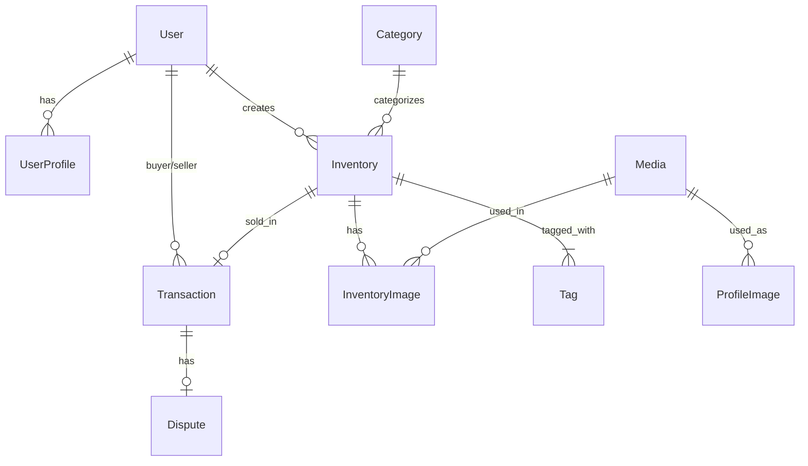

# Naming Convention Updates

## Overview

All documentation has been updated with new naming conventions for clarity and consistency.

---

## Changes Made

### 1. Listing → Inventory

**Rationale:** "Inventory" better represents the stock/items that sellers have available for sale.

| Old Name | New Name |
|----------|----------|
| Listing | Inventory |
| listing | inventory |
| listings | inventories |
| ListingImage | InventoryImage |
| listing_images | inventory_images |

**Files Updated:**
- ✅ database-schema.md
- ✅ schema-updates-v2.md
- ✅ sprint-plan.md
- ✅ prd.md
- ✅ sprint-updates-summary.md
- ✅ erd-diagram.mermaid

### 2. SellerProfile → UserProfile

**Rationale:** "UserProfile" is more generic and can accommodate buyer information too if needed in the future.

| Old Name | New Name |
|----------|----------|
| SellerProfile | UserProfile |
| seller_profile | user_profile |
| seller_profiles | user_profiles |

**Files Updated:**
- ✅ database-schema.md
- ✅ schema-updates-v2.md
- ✅ sprint-plan.md
- ✅ prd.md
- ✅ erd-diagram.mermaid

---

## Updated Model Names

### Django Apps Structure

```
marketplace/
├── accounts/           # User, UserProfile, Media, ProfileImage
├── categories/         # Category (django-treebeard)
├── inventory/          # Inventory, InventoryImage, Tag (django-taggit)
└── transactions/       # Transaction, Dispute
```

### Database Tables

| Model | Table Name |
|-------|------------|
| User | users |
| UserProfile | user_profiles |
| Media | media |
| ProfileImage | profile_images |
| Category | categories |
| Inventory | inventories |
| InventoryImage | inventory_images |
| Transaction | transactions |
| Dispute | disputes |

---

## Updated API Endpoints

### Before vs After

**Inventory Endpoints:**
```
OLD: GET  /api/listings
NEW: GET  /api/inventories

OLD: POST /api/listings
NEW: POST /api/inventories

OLD: GET  /api/listings/:id
NEW: GET  /api/inventories/:id

OLD: PUT  /api/listings/:id
NEW: PUT  /api/inventories/:id

OLD: GET  /api/listings/my-listings
NEW: GET  /api/inventories/my-inventories
```

**Profile Endpoints:**
```
OLD: GET  /api/profile (returns SellerProfile)
NEW: GET  /api/profile (returns UserProfile)

OLD: PUT  /api/profile (updates SellerProfile)
NEW: PUT  /api/profile (updates UserProfile)
```

---

## Updated Frontend Routes

**React Router Paths:**
```javascript
// Before
/listings
/listings/:id
/my-listings
/create-listing

// After
/inventories
/inventories/:id
/my-inventories
/create-inventory
```

**Component Names:**
```javascript
// Before
<ListingCard />
<ListingDetail />
<CreateListing />
<MyListings />

// After
<InventoryCard />
<InventoryDetail />
<CreateInventory />
<MyInventories />
```

---

## Updated Database Relationships

### Foreign Keys

```python
# User → Inventory
class Inventory(models.Model):
    seller = models.ForeignKey(User, related_name='inventories')

# Inventory → InventoryImage
class InventoryImage(models.Model):
    inventory = models.ForeignKey(Inventory, related_name='images')

# Transaction → Inventory
class Transaction(models.Model):
    inventory = models.OneToOneField(Inventory, related_name='transaction')
```

### Related Names

| Model | Related Name | Access Example |
|-------|--------------|----------------|
| User.inventories | inventories | `user.inventories.all()` |
| Inventory.images | images | `inventory.images.all()` |
| Inventory.transaction | transaction | `inventory.transaction` |
| User.user_profile | user_profile | `user.user_profile` |

---

## Updated ERD



---

## Search & Replace Guide

If you need to update any additional files or code:

### Using sed (Linux/Mac)
```bash
# Replace Listing → Inventory
sed -i 's/Listing/Inventory/g' yourfile.py
sed -i 's/listing/inventory/g' yourfile.py
sed -i 's/listings/inventories/g' yourfile.py

# Replace SellerProfile → UserProfile
sed -i 's/SellerProfile/UserProfile/g' yourfile.py
sed -i 's/seller_profile/user_profile/g' yourfile.py
```

### Using VS Code
1. Press `Ctrl+H` (Find and Replace)
2. Enable regex with `.*` button
3. Find: `Listing`
4. Replace: `Inventory`
5. Replace All in Files

### Python/Django Code
```python
# Update model imports
from inventory.models import Inventory, InventoryImage  # was listings.models
from accounts.models import UserProfile  # was SellerProfile

# Update queries
inventories = Inventory.objects.filter(status='ACTIVE')  # was Listing
user_profile = user.user_profile  # was user.seller_profile
```

---

## Updated User Stories

### Before
> "As a seller, I want to create a listing so I can sell my gadget"

### After
> "As a seller, I want to create an inventory item so I can sell my gadget"

---

### Before
> "As a buyer, I want to search listings so I can find gadgets"

### After
> "As a buyer, I want to search inventory so I can find gadgets"

---

## Validation Checklist

After renaming, verify:

- [ ] All model names updated (Inventory, UserProfile, InventoryImage)
- [ ] All table names updated (inventories, user_profiles, inventory_images)
- [ ] All API endpoints updated (/api/inventories, /api/profile)
- [ ] All frontend routes updated (/inventories, /my-inventories)
- [ ] All component names updated (InventoryCard, etc.)
- [ ] All related_name fields updated (user.inventories, user.user_profile)
- [ ] All imports updated in Python files
- [ ] All imports updated in JavaScript/React files
- [ ] Database migrations reflect new names
- [ ] Tests updated with new names
- [ ] Documentation updated (README, API docs, etc.)

---

## Benefits of New Names

### "Inventory" over "Listing"
✅ **Clearer Intent** - Represents stock/items available  
✅ **Industry Standard** - Common in e-commerce platforms  
✅ **Future-Proof** - Better for inventory management features  
✅ **Professional** - More business-oriented terminology  

### "UserProfile" over "SellerProfile"
✅ **Generic** - Can store both buyer and seller info  
✅ **Extensible** - Easy to add buyer-specific fields later  
✅ **Consistent** - Matches Django convention (User + UserProfile)  
✅ **Flexible** - Accommodates role changes (buyer ↔ seller)  

---

## Migration Notes

### Database Rename Migration

When you run migrations, Django will rename tables:

```python
# Generated migration file
class Migration(migrations.Migration):
    operations = [
        migrations.RenameModel(
            old_name='Listing',
            new_name='Inventory',
        ),
        migrations.RenameModel(
            old_name='ListingImage',
            new_name='InventoryImage',
        ),
        migrations.RenameModel(
            old_name='SellerProfile',
            new_name='UserProfile',
        ),
    ]
```

This will execute SQL like:
```sql
ALTER TABLE listings RENAME TO inventories;
ALTER TABLE listing_images RENAME TO inventory_images;
ALTER TABLE seller_profiles RENAME TO user_profiles;
```

---

## Quick Reference Card

| Concept | Old Term | New Term |
|---------|----------|----------|
| Item for sale | Listing | **Inventory** |
| Multiple items | Listings | **Inventories** |
| Seller details | SellerProfile | **UserProfile** |
| Item photo | ListingImage | **InventoryImage** |
| App folder | listings/ | **inventory/** |
| API path | /api/listings | **/api/inventories** |
| React route | /listings | **/inventories** |
| Database table | listings | **inventories** |
| Related name | user.listings | **user.inventories** |

---

**All documentation files have been updated with these new naming conventions.**

**Version:** 2.1 - Naming Convention Updates  
**Last Updated:** February 2026
