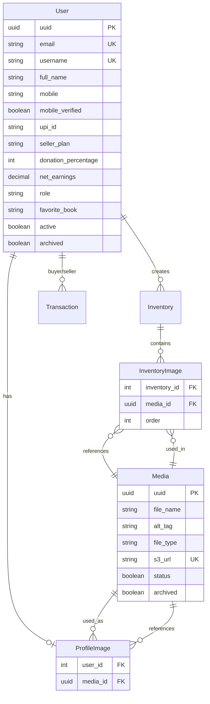

# Database Schema & Sprint Plan Updates - V2

## Overview of Changes

This document outlines major updates to the database schema and sprint plan based on new requirements:

1. **Enhanced User Model** - 22 fields including UUID, mobile, UPI, seller plans, donations
2. **Media Model** - Central repository for all images (reusable across profiles and inventorys)
3. **Auto-Generated Nicknames** - Reddit-style unique nicknames for seller profiles
4. **Auto Role Assignment** - Roles assigned based on inventory (not manual upgrade)
5. **Change Password** - Authenticated users can change their password
6. **Tailwind CSS** - Frontend styling framework

---

## 1. Enhanced User Model

### New Fields Added (Total: 22 fields)

| Field | Type | Description |
|-------|------|-------------|
| **uuid** | UUID | Unique identifier for each user |
| **email** | Email | Primary identifier (unchanged) |
| **username** | String | Unique username (required) |
| **password** | String | Hashed password (unchanged) |
| **full_name** | String | User's full name |
| **is_email_verified** | Boolean | Email verification status |
| **email_verification_token** | String | Token for email verification |
| **email_verification_expiry** | DateTime | Token expiry timestamp |
| **mobile** | String | Phone number (+919876543210) |
| **mobile_verified** | Boolean | Mobile verification status |
| **mobile_last_verified_on** | DateTime | Last mobile verification timestamp |
| **upi_id** | String | UPI ID for payments |
| **upi_id_last_verified_on** | DateTime | Last UPI verification timestamp |
| **seller_plan** | Choice | SELF_SELL, SMART_SELL, DONATE |
| **donation_percentage** | Integer | 50% or 100% (if seller_plan=DONATE) |
| **net_earnings** | Decimal | Total earnings in INR |
| **role** | Choice | BUYER, SELLER, ADMIN (auto-assigned) |
| **favorite_book** | String | Personal preference field |
| **active** | Boolean | Active status |
| **archived** | Boolean | Soft delete flag |
| **created_on** | DateTime | Account creation timestamp |
| **updated_on** | DateTime | Last update timestamp |

### Removed Fields

- ~~GUEST role~~ - Users are BUYER by default
- ~~Separate EmailVerificationToken model~~ - Now fields in User model
- ~~Separate PasswordResetToken model~~ - Token stored in User model

### New Methods

```python
def auto_assign_role(self):
    """Auto-assign SELLER if has inventory, otherwise BUYER"""
    
def verify_email(self, token):
    """Verify email with token"""
    
def verify_mobile(self):
    """Mark mobile as verified"""
    
def verify_upi_id(self):
    """Mark UPI ID as verified"""
    
def add_earnings(self, amount):
    """Add to net earnings"""
```

---

## 2. Media Model - Central Repository

### Concept

One **Media** record can be used by:
- Multiple inventorys (e.g., same product photo on different inventorys)
- Multiple user profiles (e.g., default avatar reused)
- This reduces storage costs and simplifies image management

### Model Structure

```python
class Media(models.Model):
    uuid = UUIDField  # Unique identifier
    file_name = CharField  # Original filename
    alt_tag = CharField  # Accessibility text
    file_type = CharField  # image/jpeg, image/png, image/webp
    s3_url = URLField  # Full S3 URL with CDN
    created_on = DateTimeField
    status = BooleanField  # Active/Inactive
    archived = BooleanField  # Soft delete
```

### Association Models

**InventoryImage** (Many-to-Many through model)
- One Inventory → Many InventoryImage → Many Media
- One Media → Many InventoryImage → Many Inventorys
- Allows image reuse across inventorys

**ProfileImage** (One-to-One through model)
- One User → One ProfileImage → One Media
- One Media → Many ProfileImage → Many Users
- Allows profile picture reuse

### Benefits

✅ **Cost Savings** - Upload once, use multiple times  
✅ **Consistency** - Same product shown across inventorys  
✅ **Centralized Management** - Archive/delete from one place  
✅ **Analytics** - Track which images are most popular  
✅ **Performance** - Reduced storage and bandwidth  

---

## 3. Auto-Generated Nicknames

### Format

Reddit-style: `AdjectiveNoun####`

Examples:
- `CoolPanda4782`
- `SwiftEagle2193`
- `MightyDragon5647`

### Implementation

```python
# In UserProfile.save()
if not self.nickname:
    self.nickname = self.generate_unique_nickname()

@staticmethod
def generate_unique_nickname():
    adjectives = ['Cool', 'Swift', 'Bright', 'Smart', 'Epic', ...]
    nouns = ['Panda', 'Tiger', 'Eagle', 'Falcon', 'Phoenix', ...]
    
    while True:
        nickname = f"{random.choice(adjectives)}{random.choice(nouns)}{random.randint(1000, 9999)}"
        if not UserProfile.objects.filter(nickname=nickname).exists():
            return nickname
```

### Benefits

✅ **Privacy** - No need to expose real names  
✅ **Fun** - Engaging, memorable identifiers  
✅ **Uniqueness** - Guaranteed unique via database check  
✅ **Consistency** - Standardized format  

---

## 4. Auto Role Assignment Logic

### Previous Flow (Removed)

❌ User signs up as GUEST  
❌ User manually upgrades to BUYER or SELLER  

### New Flow

✅ User signs up → Default role = **BUYER**  
✅ User creates first inventory → Auto-upgrade to **SELLER**  
✅ User deletes all inventorys → Auto-downgrade to **BUYER**  

### Implementation

```python
# Called after login
user.auto_assign_role()

# Called after inventory creation
inventory.save()
inventory.seller.auto_assign_role()

# Called after inventory deletion
inventory.delete()
seller.auto_assign_role()
```

### Benefits

✅ **Simpler UX** - No manual role selection  
✅ **Automatic** - Role reflects actual behavior  
✅ **Accurate** - Always up-to-date based on inventory  

---

## 5. Change Password Feature

### New API Endpoint

```
PATCH /api/auth/change-password
```

**Request Body:**
```json
{
  "current_password": "oldpass123",
  "new_password": "newpass456"
}
```

**Response:**
```json
{
  "message": "Password changed successfully"
}
```

### Validation

- User must be authenticated (JWT required)
- Current password must be correct
- New password must meet strength requirements
- Cannot reuse current password

### Frontend Flow

1. User clicks "Change Password" in settings
2. Form with current_password and new_password fields
3. Submit PATCH request
4. Show success message
5. Optional: Force re-login with new password

---

## 6. Tailwind CSS Integration

### Why Tailwind?

✅ **Utility-First** - Rapid development with pre-defined classes  
✅ **Responsive** - Built-in breakpoints (sm, md, lg, xl)  
✅ **Customizable** - Easy theme configuration  
✅ **Small Bundle** - PurgeCSS removes unused styles  
✅ **Modern** - Industry standard for React projects  

### Setup (Sprint 1)

```bash
npm install -D tailwindcss postcss autoprefixer
npx tailwindcss init -p
```

**tailwind.config.js:**
```javascript
module.exports = {
  content: [
    "./src/**/*.{js,jsx,ts,tsx}",
  ],
  theme: {
    extend: {
      colors: {
        primary: '#007bff',
        secondary: '#6c757d',
      }
    },
  },
  plugins: [],
}
```

**src/index.css:**
```css
@tailwind base;
@tailwind components;
@tailwind utilities;
```

### Usage Examples

```jsx
// Button
<button className="bg-primary text-white px-4 py-2 rounded hover:bg-blue-600">
  Buy Now
</button>

// Card
<div className="bg-white shadow-md rounded-lg p-6">
  <h2 className="text-xl font-bold mb-2">iPhone 13 Pro</h2>
  <p className="text-gray-600">₹85,000</p>
</div>

// Grid
<div className="grid grid-cols-1 md:grid-cols-2 lg:grid-cols-4 gap-4">
  {inventorys.map(inventory => <InventoryCard key={inventory.id} {...inventory} />)}
</div>
```

---

## Sprint Plan Updates

### Sprint 0 (Pre-Development)

**Add to Design Tasks:**
- [ ] Configure Tailwind CSS in React project
- [ ] Define custom theme (colors, fonts, spacing)
- [ ] Create Tailwind component library (buttons, cards, forms)

### Sprint 1 (Auth & User Management)

**Backend Changes:**

1. **User Model Updates:**
   - [ ] Add all 22 fields to User model (see table above)
   - [ ] Remove GUEST role, default to BUYER
   - [ ] Implement auto_assign_role() method
   - [ ] Add verify_mobile(), verify_upi_id(), add_earnings() methods
   - [ ] Store email_verification_token directly in User (no separate table)

2. **New API Endpoints:**
   - [ ] PATCH `/api/auth/change-password` - Change password for authenticated users
   - [ ] POST `/api/auth/verify-mobile` - Verify mobile number (optional for V1)
   - [ ] POST `/api/auth/verify-upi` - Verify UPI ID (optional for V1)
   - [ ] Remove `/api/auth/upgrade-role` endpoint (auto-assignment instead)

3. **Media Model:**
   - [ ] Create Media model with UUID, file_name, alt_tag, file_type, s3_url
   - [ ] Implement Media.create_from_upload() class method
   - [ ] Create ProfileImage association model (User ↔ Media)

**Frontend Changes:**

1. **Signup/Login Updates:**
   - [ ] Add username field to signup form
   - [ ] Add full_name field to signup form
   - [ ] Remove role selection (auto-assigned)
   - [ ] Show default role as BUYER after signup

2. **Profile Management:**
   - [ ] Add change password form
   - [ ] Add mobile number field (optional)
   - [ ] Add UPI ID field (optional)
   - [ ] Add favorite_book field (optional)
   - [ ] Add seller_plan selection (for sellers)
   - [ ] Add donation_percentage selection (if DONATE plan)
   - [ ] Show net_earnings for sellers

3. **Navigation:**
   - [ ] Remove GUEST-specific UI (no role upgrade prompt)
   - [ ] Auto-show "Sell Item" button when user becomes SELLER

4. **Tailwind CSS:**
   - [ ] Install and configure Tailwind
   - [ ] Convert all Bootstrap/CSS to Tailwind utility classes
   - [ ] Create reusable Tailwind components

**Estimated Story Points:** Sprint 1 increases from 45 to **55 points** (+10)

### Sprint 2 (Inventorys & Categories)

**Backend Changes:**

1. **Inventory Model Updates:**
   - [ ] No direct changes (already using relationship to User)
   - [ ] After inventory creation, call seller.auto_assign_role()
   - [ ] After inventory deletion, call seller.auto_assign_role()

2. **InventoryImage Updates:**
   - [ ] Change from direct S3 URL to Media FK relationship
   - [ ] Support image reuse (multiple inventorys can use same Media)
   - [ ] Update image upload logic to create Media first, then InventoryImage

**Frontend Changes:**

1. **Image Upload:**
   - [ ] Upload creates Media record
   - [ ] Media UUID returned and associated with inventory
   - [ ] Show existing Media library for image reuse (optional for V1)

**Estimated Story Points:** Sprint 2 increases from 52 to **58 points** (+6)

---

## Updated ERD (Key Changes)



---

## Migration Strategy

### Order of Migrations

1. **Create Media model** (accounts app)
   ```bash
   python manage.py makemigrations accounts
   ```

2. **Update User model** with all new fields
   ```bash
   python manage.py makemigrations accounts
   ```

3. **Create ProfileImage model** (accounts app)
   ```bash
   python manage.py makemigrations accounts
   ```

4. **Update InventoryImage model** to use Media FK
   ```bash
   python manage.py makemigrations inventorys
   ```

5. **Data Migration** (migrate existing S3 URLs to Media records)
   ```python
   # Create Media records for existing inventory images
   for inventory_image in InventoryImage.objects.all():
       media = Media.objects.create(
           file_name=f"legacy_image_{inventory_image.id}",
           file_type="image/jpeg",
           s3_url=inventory_image.image_url  # old field
       )
       inventory_image.media = media
       inventory_image.save()
   ```

6. **Run all migrations**
   ```bash
   python manage.py migrate
   ```

---

## Testing Updates

### New Test Cases

**User Model Tests:**
- [ ] Test auto_assign_role() - becomes SELLER when has inventorys
- [ ] Test auto_assign_role() - becomes BUYER when no inventorys
- [ ] Test verify_email() - valid token
- [ ] Test verify_email() - expired token
- [ ] Test verify_mobile()
- [ ] Test verify_upi_id()
- [ ] Test add_earnings()
- [ ] Test all 22 fields save correctly

**Media Model Tests:**
- [ ] Test create_from_upload() - creates Media record
- [ ] Test Media can be reused (multiple InventoryImages point to same Media)
- [ ] Test Media.get_usage_count()
- [ ] Test Media.is_reusable()

**UserProfile Tests:**
- [ ] Test auto-generated nickname uniqueness
- [ ] Test nickname format (AdjectiveNoun####)
- [ ] Test nickname collision handling

**API Tests:**
- [ ] Test PATCH /api/auth/change-password - success
- [ ] Test PATCH /api/auth/change-password - wrong current password
- [ ] Test PATCH /api/auth/change-password - unauthenticated

---

## Cost Impact

### Storage Costs

**Before (Direct S3 URLs):**
- 100 inventorys × 5 images = 500 images
- Each 5MB = 2.5GB storage
- Cost: ~₹150/month

**After (Media Repository with Reuse):**
- Assume 30% image reuse across inventorys
- 500 images → 350 unique Media records
- Each 5MB = 1.75GB storage
- Cost: ~₹105/month

**Savings:** ~₹45/month (30% reduction)

---

## Documentation Updates Needed

1. **API Documentation:**
   - Update User schema (22 fields)
   - Add PATCH /api/auth/change-password endpoint
   - Remove /api/auth/upgrade-role endpoint
   - Update Media-related endpoints

2. **Frontend Documentation:**
   - Tailwind CSS setup guide
   - Component library documentation
   - Image upload flow with Media model

3. **Database Documentation:**
   - Updated ERD with Media model
   - Migration guide for existing data
   - Media reuse best practices

---

## Summary of Changes

| Area | Change | Impact |
|------|--------|--------|
| **User Model** | 22 fields (was 5) | +3 story points |
| **Role Logic** | Auto-assignment (was manual) | -2 story points (simpler) |
| **Media Model** | New central repository | +5 story points |
| **Nicknames** | Auto-generated (Reddit-style) | +2 story points |
| **Change Password** | New endpoint | +2 story points |
| **Tailwind CSS** | Replace custom CSS | +3 story points (setup) |
| **Total Sprint 1** | 45 → **55 points** | +10 points |
| **Total Sprint 2** | 52 → **58 points** | +6 points |
| **Overall Project** | 232 → **248 points** | +16 points |

---

**Next Steps:**

1. Review and approve these changes
2. Update database-schema.md with final models
3. Update sprint-plan.md with new tasks
4. Create Tailwind CSS setup guide
5. Create Media upload guide

---

**Version:** 2.0 - Enhanced User Model + Media Repository  
**Last Updated:** February 2026
